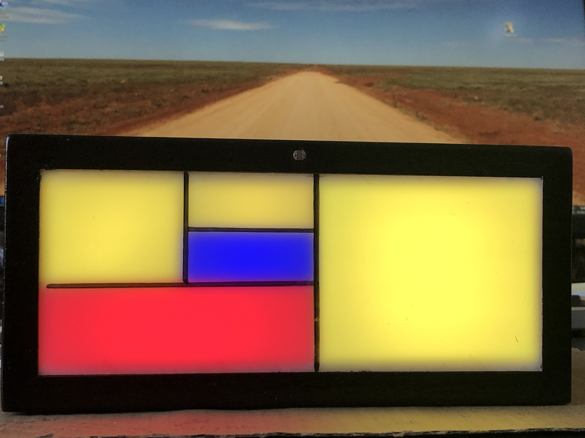

# Fibonacci clock and stick
Software for Fibonacci clocks. 
Version V007 is a simple version for the Fibonacci clock.  
Version V038 includes many features like Keypad input, digital  MAX7219 or HK16K33 displays 
storage in DS3231 NVRAM, Bluetooth communication. Choice between WS2812 and SK6812 LED strips  
The software contains many examples how to use communication, input and output with the Arduino platform. 
The page with instructions to built various formats of the clocks can be found here:  https://ednieuw.home.xs4all.nl/Woordklok/FibonacciClock/FibonacciClock.html  
v
